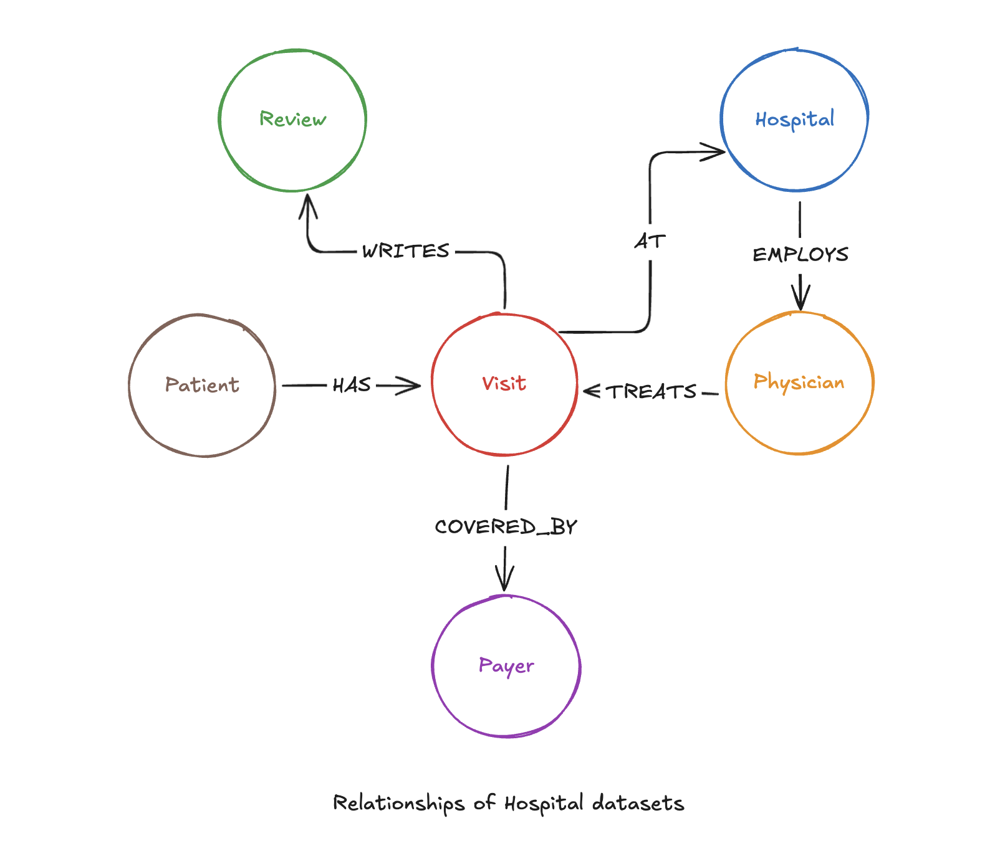

# A03 - RAG and Reasoning Frameworks Tutorial

This repository contains the code and documentation for a comprehensive tutorial on Retrieval-Augmented Generation (RAG) and reasoning frameworks. The project demonstrates how to build, compare, and evaluate two types of AI systems: a foundational RAG chatbot and a sophisticated ReAct agent capable of complex, multi-step reasoning.

The primary goal is to provide a clear, end-to-end guide for teams looking to build intelligent, knowledge-based AI systems that can reason over private data.

## Key Features

-   **Basic RAG Implementation:** A straightforward conversational chatbot using a Pinecone vector database for efficient semantic search.
-   **Advanced ReAct Agent:** A powerful agent that uses a Neo4j Knowledge Graph and can autonomously choose between different tools to answer complex, multi-faceted questions.
-   **Comparative Analysis:** Demonstrates the architectural differences and capabilities between a simple RAG pipeline and a reasoning agent.
-   **Evaluation Framework:** Includes a custom Python script to evaluate the advanced agent on key business metrics like cost, latency, and tool selection accuracy.
-   **Documentation:** A detailed tutorial document (generated separately) explains these concepts for a non-technical audience.

## Data Architecture

The project uses a simulated dataset of hospital records. For the advanced agent, these records are structured as a knowledge graph in Neo4j to capture the rich relationships between entities.




## Setup and Installation


### 1. Clone the Repository

```bash
git clone https://github.com/vansy1511/vansy-f8a-genai-test.git
cd vansy-f8a-genai-test
```

### 2. Install Dependencies

This project uses Poetry to manage dependencies.

```bash
poetry install
```

### 3. Setup Pinecone and Neo4j

#### Pinecone
- Create Pinecone account at [link](https://app.pinecone.io/organizations/-OT0QXLFQ4Mm2p_BkE71/projects/a4da8553-33b8-44c5-8eea-e542fd0b8a55/indexes)
- Save the api key as `PINECONE_API_KEY`

#### Neo4j
- Create Neo4j account at [link](https://login.neo4j.com)
- Create a free AuraDB
- Save credentials such as `NEO4J_URI`, `NEO4J_USERNAME`, `NEO4J_PASSWORD`, `NEO4J_DATABASE`.

### 4. Set Up Environment Variables

Create a `.env` file in the root of the project by copying the example file:

```bash
cp .env.example .env
```

Now, edit the `.env` file and add your API keys and credentials:

```
# .env
PINECONE_API_KEY="..."
OPENAI_API_KEY="sk-..."

NEO4J_URI="neo4j+s://..."
NEO4J_USERNAME="neo4j"
NEO4J_PASSWORD="..."
NEO4J_DATABASE="..."
```


## How to Run

### 1. Basic RAG Chatbot

-   Launch Jupyter Lab or Jupyter Notebook:
    ```bash
    poetry run jupyter lab
    ```
-   Navigate to the `notebooks/` directory 
-   Open `data_processing.ipynb` and run cells to processing, exploring data, and upload data to Pinecone
-   Open `basic_rag_chatbot.ipynb` and the cells sequentially to interact with the basic RAG chatbot.

### 2. Advanced ReAct Agent & Evaluation

-   Run the script to bulk upload data to Neo4j instance: `python src/vansy_f8a_genai_test/a03_rag_and_reasoning_frameworks_tutorial/assets/code/bulk_hospital_uploader.py`
-   In Jupyter, open `notebooks/react_agent_chatbot.ipynb`.
-   Run the cells in the notebook. This will:
    1.  Set up the ReAct agent with its specialized tools.
    2.  Allow you to interact with the agent in a chat loop.
    3.  Execute the evaluation script using the questions in `data/evaluation_data.csv`.
    4.  Print the summary results and save the detailed log to `data/evaluation_results.csv`.

## Evaluation Results

The advanced ReAct agent was evaluated on 100 test questions covering both factual queries and subjective analysis.

| Metric                        | Result    |
| ----------------------------- | --------- |
| **Tool Selection Accuracy**   | **90.7%** |
| **Average Latency (seconds)** | **5.18**  |
| **Total Cost (USD)**          | **$0.013**  |

## Author

This project was created and developed by **Van Sy**.

-   **GitHub**: [@vansy1511](https://github.com/vansy1511)
-   **LinkedIn**: [Van Sy](https://www.linkedin.com/in/syvan/)
-   **Email**: `vansy.work@gmail.com`