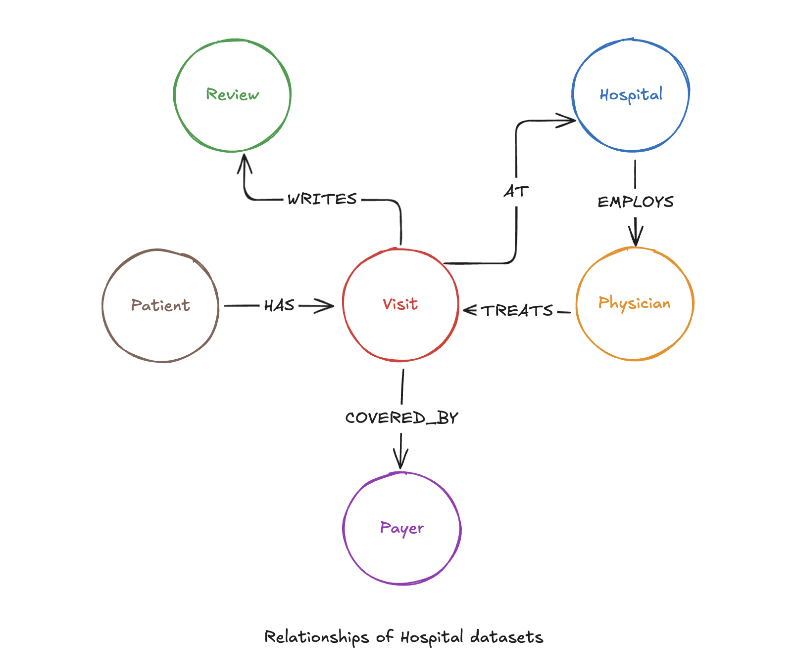
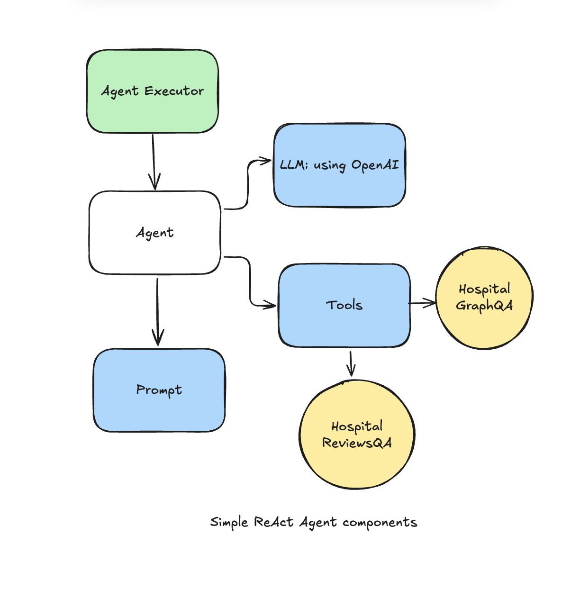

## I. Introduction

### 1. What is Retrieval-Augmented Generation (RAG)?
<details open>
<summary>Understanding AI That Can Use Your Company's Documents</summary>

---
-   Imagine an AI assistant, like ChatGPT, that has read every single one of your company's internal documents, reports, and data.
-   Instead of answering questions from its general internet knowledge, it finds the exact, verified information from *your* private documents first.
-   This process of **finding** relevant facts and then **using** them to generate a smart, accurate answer is called Retrieval-Augmented Generation, or RAG.
-   Think of it as giving the AI an "open-book exam" where the "book" is your organization's trusted knowledge base.
-   This solves a major problem with AI: it prevents the system from making up facts (called "hallucinations") and ensures the answers are based on real, up-to-date company data.
---
</details>

### 2. Why Does This Matter for Us?
<details open>
<summary>The Business Value of Building Knowledge-Based AI</summary>

---
-   This technology allows our teams to build AI systems that are not just intelligent, but also reliable and trustworthy.
-   By using our own data, we can create specialized assistants that understand our specific business, products, and customers.
-   These systems can power sophisticated tools for:
    -   **Instant, Accurate Answers:** Employees can ask complex questions about procedures or data and get immediate, correct responses.
    -   **Smarter Decision-Making:** AI can analyze internal reports to support strategic decisions with verifiable data.
    -   **Enhanced Customer Support:** Customer-facing bots can provide helpful answers based on the latest product documentation, not generic information.
-   Ultimately, this is about transforming our internal knowledge from static documents into an active, intelligent resource that the entire organization can use.
---
</details>

---

## II. How RAG Works: The Core Components

### 1. The Basic Architecture
<details open>
<summary>A Three-Step Guide: Find, Add, and Generate</summary>

---
-   At its heart, a RAG system works in three simple steps to answer a question:
-   **1. Find (Retrieval):** The system first searches through your company's digital library (the knowledge base) to find small, specific snippets of information that are most relevant to the question asked.
-   **2. Add (Augmentation):** It then takes these relevant facts and "adds" them to the original question, giving the AI crucial context it needs. It's like handing a person a cheat sheet with all the right answers before they speak.
-   **3. Generate (Generation):** Finally, with this new, context-rich information, the AI generates a clear, accurate, and helpful answer, directly based on the facts it was given.
---
</details>

### 2. Preparing Your Information for AI System
<details open>
<summary>How to Break Down Documents for an AI to Read (Chunking)</summary>

---
-   An AI can't read a 100-page document all at once; it needs information in small, manageable pieces, like flashcards.
-   The process of intelligently splitting your large documents into these focused pieces is called **chunking**.
-   The goal of chunking is to make sure that each piece contains a complete, self-contained idea. This helps the AI find the most accurate information later.
-   There are several common strategies for this, each with its own strengths.  
  
Here are some common chunking strategies:

---
#### Fixed-Size Chunking
-   This is the simplest approach.
-   Imagine taking a long document and cutting it into equal-sized pieces (e.g., every 500 words).
-   **Pros:** It's very fast and easy to do.
-   **Cons:** It can awkwardly split a sentence or idea in the middle, separating related information.

---
#### Content-Aware Chunking
-   This is a smarter method.
-   Instead of cutting randomly, it splits the document based on its structure, like breaking it apart at the end of paragraphs, headings, or bullet points.
-   **Pros:** It keeps complete thoughts and related sentences together, which results in much better quality for the AI.
-   **Cons:** It requires a bit more intelligence to set up.

---
#### Recursive Chunking
-   This is an advanced, "best-of-both-worlds" approach.
-   It starts by trying to split the text by logical separators (like paragraphs). If the resulting chunk is still too big, it "recursively" splits it again using a less important separator, and so on, until the chunks are the perfect size.
-   **Pros:** It's highly effective at creating meaningful, well-sized chunks from complex documents.
-   **Cons:** It is the most complex of the three strategies.
---
</details>

### 3. Creating a Digital Library for AI
<details open>
<summary>Introducing Vector Databases: A Special Library for AI Knowledge</summary>

---
-   Once our documents are chunked, we need a special place to store them so the AI can search them instantly. This is where a **vector database** comes in.
-   Think of it like a highly advanced library catalog. Instead of organizing books by title or author, it organizes information by *meaning* and *context*.
-   Every chunk of text is converted into a numerical representation (a "vector") that captures its meaning.
-   When a question is asked, the system looks for the chunks whose meanings are closest to the meaning of the question.
-   This allows the AI to find the right information in milliseconds, even if the question doesn't use the exact same keywords that are in the document.
---
</details>

---
## III. A Basic Q&A System example

### 1. Building a Simple RAG System
<details open>
<summary>Walkthrough: Answering Questions Using Hospital Data</summary>

---
-   To see RAG in action, I built my first implementation: a simple question-and-answer chatbot.
-   The goal was to create an AI assistant that could correctly answer questions using a collection of simulated hospital visit records.
-   My data includes information connecting patients, their hospital visits, treating physicians, and insurance payers, as shown in the diagram below.
- 
-   The entire system was built using a few key tools:
    -   `LangChain`: The main framework that acts like plumbing, connecting all the different parts together.
    -   `Pinecone`: The high-speed "digital library" (vector database) where we stored our hospital data for the AI to search.
    -   `OpenAI GPT-4o-mini`: The "AI brain" responsible for understanding questions and generating clear answers.
-   I used the `basic_rag_chatbot.ipynb` notebook to orchestrate this entire process. [Click here to open the file](a03_rag_and_reasoning_frameworks_tutorial/assets/code/basic_rag_chatbot.ipynb)

---
#### Key Features of My Simple Chatbot
-   I gave the AI a very specific set of instructions to ensure it behaved correctly.  
```
"""
You are a helpful AI assistant for answering questions based on the provided documents.
Your goal is to provide accurate and concise answers.
Use the following pieces of context to answer the question at the end.
If you don't know the answer, just say that you don't know. DO NOT try to make up an answer.
Keep the answer concise.
And you need to use same language with user's questions.

CONTEXT:
{context}

CHAT HISTORY:
{chat_history}

QUESTION:
{question}

Answer in the same language as the question.
Helpful Answer:
"""
```
-   The most important rules I gave it were:
    -   Only use the provided hospital documents to answer a question.
    -   If the answer isn't in the documents, say **"I don't know."**
    -   Do not make up information under any circumstances.
-   The chatbot also has a short-term memory, allowing it to remember the context of the current conversation.

---
#### Seeing It in Action: Example Questions and Answers
-   I tested the system with a few questions to see how it performed.

-   **Test 1: Asking a question the AI can answer.**
    -   I asked: `what treatments did Mrs. Brandy Flowers receive during her hospital stay?`
    -   The system correctly found the relevant patient record in `Pinecone` and generated a perfect, factual answer based only on that document.

```
User: what treatments did Mrs. Brandy Flowers receive during her hospital stay?
Chatbot: Mrs. Brandy Flowers received a combination of inhaled bronchodilators (such as albuterol) and corticosteroids to manage airway inflammation. Pulmonary function tests were conducted to assess lung function, and antibiotics were administered if a bacterial infection was suspected. She was also advised on lifestyle modifications, including smoking cessation and environmental control.

--- Source Documents ---
- Page N/A: 
    Visit ID: 4
    Patient: Mrs. Brandy Flowers, Sex: Male, DOB: 1989-01-26, Blood Type: AB+
    Physician: Mark Vang...
    ...
    Treatment: Prescribed a combination of inhaled bronchodilators...
```

-   **Test 2: Asking a question outside its knowledge base.**
    -   I then asked a general knowledge question: `How many countries in the world?`
    -   As instructed, the AI correctly responded that it did not know, proving it would not invent answers or use outside information. This is exactly the safe behavior we want.

```
User: How many countries in the world?
Chatbot: I don't know.
```
---
</details>


---
## IV. Level Up: Teaching AI to "Think"

### 1. Introducing Reasoning Frameworks
<details open>
<summary>Moving Beyond Simple Answers to Step-by-Step Reasoning</summary>

---
-   Our basic RAG system is great at finding a single piece of information to answer a direct question.
-   But what if a question is more complex and requires multiple steps to solve? For example, "Find the total billing amount for all patients treated by Dr. Mark Vang."
-   A simple RAG system would struggle because it can't perform calculations or combine information from multiple documents in a logical sequence.
-   This is where **reasoning frameworks** come in. They give an AI the ability to "think" by breaking down a complex problem into a series of smaller, manageable steps.
-   Think of it as upgrading our AI from a simple search tool into a junior analyst that can create a plan and execute it.
---
</details>

### 2. Common Reasoning Frameworks
<details open>
<summary>Exploring Different AI "Thinking" Styles</summary>

---
-   There are several popular strategies for enabling AI reasoning. Each one gives the AI a different way to "think" through a problem.

---
#### Chain-of-Thought
-   This is the most straightforward reasoning method, where the AI is prompted to "think step-by-step" before giving the final answer.
-   It’s like asking someone to show their work on a math problem. By writing out its logic, the AI is more likely to arrive at the correct conclusion.
-   **Example:**
    -   **Question:** `Who was admitted to the hospital first, Brandy Flowers or Brandy Clark?`
    -   **AI's Internal "Chain of Thought":**
        -   *Step 1: I need to find the admission date for Brandy Flowers. The document says 2021-07-09.*
        -   *Step 2: Now I need the admission date for Brandy Clark. The document says 2020-04-10.*
        -   *Step 3: Comparing the two dates, 2020 is earlier than 2021.*
    -   **Final Answer:** `Brandy Clark was admitted first.`

---
#### Tree-of-Thought
-   This is a more advanced brainstorming approach. Instead of following just one line of thought, the AI explores several different reasoning paths at once.
-   It evaluates which paths are most promising and drops the ones that lead to a dead end, allowing it to solve more complex or ambiguous problems.
-   **Example:**
    -   **Question:** `Which physician at 'Lewis-Nelson' hospital has the highest-rated patient review?`
    -   **AI's Internal "Tree of Thought":**
        -   ***Path A:*** *I'll search for all physicians at Lewis-Nelson. I found Dr. Jacobs. Her patient has no written review. This path is a dead end.*
        -   ***Path B:*** *I'll search for all positive patient reviews first, then check the hospital. I found a good review, but it's for 'Burke, Griffin and Cooper' hospital. This path is not relevant.*
        -   ***Path C:*** *I'll list all visits at Lewis-Nelson and check their reviews. Visit 1 has no review. Visit 2 has no review.*
    -   **Final Answer:** `Based on the documents, there are no written patient reviews for visits at the Lewis-Nelson hospital.`

---
#### ReAct: Combining Thought with Action
-   `ReAct` is a powerful framework that stands for **"Reason and Act."** It allows the AI to not only think but also use pre-approved tools (like a calculator or our RAG search system).
-   The AI works in a loop: it **Reasons** what to do, **Acts** by using a tool, and **Observes** the result to decide its next step.
-   **Example:**
    -   **Question:** `What is the combined billing cost for Brandy Flowers and Brandy Clark?`
    -   **AI's Thought/Action Process:**
        -   **Thought:** *I need the billing amount for Brandy Flowers.*
        -   **Action:** *Use Search Tool for "Brandy Flowers billing cost".*
        -   **Observation:** *The tool returns `$18086`.*
        -   **Thought:** *Now I need the billing amount for Brandy Clark.*
        -   **Action:** *Use Search Tool for "Brandy Clark billing cost".*
        -   **Observation:** *The tool returns `$17634`.*
        -   **Thought:** *I have both costs. I must add them together.*
        -   **Action:** *Use Calculator Tool with "18086 + 17634".*
    -   **Final Answer:** `The combined billing cost is $35,720.`
---
</details>

---
## V. ReAct Agent chatbot

### 1. Building a RAG System with Reasoning
<details open>
<summary>Walkthrough: Building a Smarter Agent for Complex Hospital Questions</summary>

---
-   For the second project, I built a much more powerful AI assistant using the **`ReAct` (Reasoning and Acting)** framework we discussed earlier.
-   Unlike our first basic chatbot, this "Agent" doesn't just find information—it can create a plan and choose the right tool for the job.
-   I gave the agent two specialized tools to work with:
    -   **The Fact-Checker (`HospitalGraphQA`):** This tool is an expert at answering objective, data-driven questions. The agent uses this tool for tasks like counting things (`how many visits?`), listing facts (`name all physicians`), or finding specific numbers (`what was the billing cost?`).
    -   **The Opinion-Finder (`HospitalReviewsQA`):** This tool specializes in understanding subjective, human-like questions. The agent uses this to find out how patients *feel* about something (`was the staff friendly?`), to summarize complaints, or to gauge overall satisfaction.
-   The "magic" of the ReAct agent, built in `react_agent_chatbot.ipynb` notebook, is its ability to read a question and reason about which tool is the correct one to use. [Click here to open the file](a03_rag_and_reasoning_frameworks_tutorial/assets/code/react_agent_chatbot.ipynb)
-   

---
#### A Smarter Library: Using a Knowledge Graph (Neo4j)
-   For this advanced agent, I upgraded data storage from a simple vector database to a **Knowledge Graph** using a tool called `Neo4j`.
-   While our first library was like a catalog of flashcards, a knowledge graph is like a web of interconnected ideas.
-   It doesn't just store information; it understands the **relationships** between them (e.g., a `Patient` *HAS* a `Visit`, which is `TREATED_BY` a `Physician`, which is `EMPLOYED_BY` a `Hospital`).
-   This interconnected structure is what allows our "Fact-Checker" tool to answer much more complex questions that require joining different pieces of information together.

---
#### The Result: A More Capable AI Assistant in Action
-   When we ask the agent a question, we can see its "thought process" as it decides which tool to use.
-   For example, when I asked a factual question, the agent correctly reasoned that it needed the `HospitalGraphQA` tool to count something.

```
User: how many hospital in Florida?

> Entering new AgentExecutor chain...
I need to find out the number of hospitals in Florida. Since this is an objective question that involves counting, I will use the HospitalGraphQA tool to get the information.

Action: HospitalGraphQA  
Action Input: how many hospital in Florida?  

> Entering new GraphCypherQAChain chain...
Generated Cypher:
MATCH (h:Hospital)
WHERE h.state_name = 'FL'
RETURN COUNT(h) AS hospital_count
Full Context:
[{'hospital_count': 7}]

> Finished chain.
{'query': 'how many hospital in Florida?', 'result': 'There are 7 hospitals in Florida.'}
I now know the final answer.  
Final Answer: There are 7 hospitals in Florida.
```
-   This ability to choose the right tool for the right job makes the agent incredibly versatile and accurate.
---
</details>

### 2. Measuring the Agent
<details open>
<summary>How I Evaluated Performance: Cost, Speed, and Accuracy</summary>

---
-   To ensure the agent was not just clever but also effective, we ran it through a rigorous test using the `agent_evaluator.py` script.
-   I created a test set of 100 different questions (`evaluation_data.csv`) and measured the agent on three key business metrics.  

Here are the results of my evaluation:

---
#### Tool Selection Accuracy: 91%
-   This was my most important metric. It measures **how often the AI chose the correct tool** (Fact-Checker vs. Opinion-Finder) for the question.
-   As `91%` accuracy, looks high but if applied to real products it is not good at all, because a few percent error for a large number of users will be a big problem. I think it can be improved by refining prompt, or using better foundation models.

---
#### Average Latency: 5.2 seconds
-   This measures the average time it took for the agent to provide a final answer after receiving a question.
-   An average of just over `5` seconds is a good result, showing the system can handle complex reasoning without making the user wait too long.

---
#### Total Cost: $0.013
-   This is the total operational cost (in USD) to run all 100 test questions through the `OpenAI` model.
-   This part will depend on the budget and policy for the product, then there will be a more objective assessment.
---
</details>

---
## VI. The Tool Landscape

### 1. Choosing a Toolkit: LangChain vs. LlamaIndex
<details open>
<summary>A Comparison of the Main RAG Frameworks</summary>

---
-   Frameworks are the "supervisors" of our AI system. They don't store data or act as the AI brain, but they connect all the pieces and manage the workflow.

---
#### LangChain
-   Think of this as a versatile, all-purpose **Swiss Army knife** for building AI applications.
-   **Pro:** It is extremely flexible and provides a massive set of components for creating complex systems, like our advanced `ReAct` agent.
-   **Con:** Its vast number of options can be overwhelming if all you need is a simple document Q&A system.

---
#### LlamaIndex
-   Think of this as a highly specialized **master librarian**. Its entire focus is on organizing your data library and making search as effective as possible.
-   **Pro:** It is expertly designed and optimized for building the best possible "retrieval" (search) pipeline for your documents.
-   **Con:** It is less flexible for building general-purpose AI agents that need to use many different kinds of non-search tools.

---
</details>

### 2. Choosing AI's Library: Vector Databases and Knowledge Graphs
<details open>
<summary>A Look at Pinecone, Weaviate, Chroma, and Neo4j</summary>

---
-   These tools act as the "long-term memory" or digital library for our AI. Where you store your data determines the kinds of questions your AI can answer.

---
#### Pinecone
-   A premium, high-performance service. It's like hiring a professional librarian who manages everything for you.
-   **Pro:** Extremely fast, scalable, and very easy to use because it's a fully managed service.
-   **Con:** Can be more expensive than options you host yourself and offers less fine-grained control.

---
#### Weaviate
-   A powerful and flexible open-source option that you can manage yourself or use as a service.
-   **Pro:** Highly customizable with advanced search features built-in.
-   **Con:** Can be more complex to set up and manage if you choose to host it yourself.

---
#### Chroma
-   A simple, lightweight open-source tool. It’s like a personal bookshelf you can set up on your computer in minutes.
-   **Pro:** Very simple to get started with and free to use, making it perfect for development and small projects.
-   **Con:** Not designed for the performance needs of very large-scale, enterprise-level applications.

---
#### Neo4j (Knowledge Graph)
-   If a vector database is a collection of individual facts, `Neo4j` is a **mind map that shows how those facts are connected**.
-   **Pro:** Unmatched at answering complex questions about relationships (e.g., "Which doctors work at the same hospital?").
-   **Con:** It represents a different way of thinking about data, which can be more complex to learn and might be overkill for simple fact-finding tasks.
---
</details>

---

## VII. Measuring Our AI's Performance

### 1. Why Evaluation is Critical
<details open>
<summary>Why We Must Test Our AI Systems</summary>

---
-   Building an AI system is only half the battle. We must be able to measure its performance to know if it's actually useful, trustworthy, and ready for business use.
-   Evaluation answers critical questions like:
    -   Is the AI providing accurate answers?
    -   Can we trust it not to make things up?
    -   Is it fast enough to be helpful?
    -   Is it cost-effective to operate?
-   By continuously testing, we can identify weaknesses, make improvements, and build confidence in our AI tools before they are deployed.
---
</details>

### 2. Key Metrics for a RAG System
<details open>
<summary>Measuring the Quality of Answers (RAG Metrics)</summary>

---
-   For a standard RAG system, we focus on the quality of its two-step process: finding information and then generating an answer.

---
#### Retrieval Quality
-   This metric asks: **Did the AI find the correct piece of information?**
-   Imagine asking a librarian for a book on a specific topic. This metric measures whether the librarian pulled the right book from the shelf.
-   If the system retrieves irrelevant documents, the final answer will almost certainly be wrong, no matter how good the AI brain is.

---
#### Generation Quality
-   This metric asks: **Was the final answer faithful to the information it found?**
-   Once the librarian has the right book, this measures how well they summarize the key points for you.
-   The answer must be factually consistent with the source documents. This is our main defense against the AI "hallucinating" or inventing information.
---
</details>

### 3. Evaluating a ReAct Agent
<details open>
<summary>Checking the Agent's Decision-Making Skills</summary>

---
-   When evaluating an advanced agent like the one we built, we measure everything above, plus one more critical component: its ability to **reason and make choices**.

---
#### Tool Selection Accuracy
-   This is the most important metric for an agent. It asks: **Did the AI choose the right tool for the job?**
-   For example, did it correctly choose the "Fact-Checker" for a numbers-based question and the "Opinion-Finder" for a sentiment-based question?
-   As we saw in the project, our agent achieved **`91% accuracy`** in this task, but I think this is still a poor accuracy for a real product. Imagine if you get just 1% wrong out of 1 million requests, how many customers will have a bad experience?

---
#### Performance and Cost
-   These are key business metrics.
-   **Latency:** How fast is the system?  
-   **Cost:** How much does it cost to run?  
---
</details>

### 4. How We Perform the Evaluation
<details open>
<summary>Using AI to Judge AI (Evaluation Tools)</summary>

---
-   Checking hundreds of AI-generated answers by hand is slow and expensive. Instead, we can use specialized frameworks to automate this process.
-   **RAGAS (RAG Assessment):**
    -   This is a popular framework that essentially uses a powerful "judge AI" to score the performance of our RAG system.
    -   It can automatically measure our Retrieval Quality and Generation Quality, providing fast, consistent feedback.
-   **Custom Evaluation Approaches:**
    -   For my agent, we built a custom script (`agent_evaluator.py`) to measure the things that mattered most to us: tool accuracy, latency, and cost.
    -   This allowed us to create a repeatable, automated test tailored to our specific business goals.
---
</details>

---
## VIII. Real-World Impact

### 1. Case Study Examples
<details open>
<summary>How Companies are Using RAG and Reasoning Today</summary>

---
-   This technology is not just theoretical; it's already transforming how businesses operate. Here are a couple of powerful, real-world examples.

---
#### Case Study 1: The Super-Powered Customer Support Agent
-   **The Problem:** A large e-commerce company has thousands of product manuals, policy documents, and troubleshooting guides. Their customer support agents spend most of their day searching through this massive library to answer customer questions, leading to long wait times and inconsistent answers.
-   **The Solution:** They build a RAG agent and train it on their entire knowledge base. This agent is integrated into their customer chat and also given to their support team as an internal assistant.
-   **The Business Impact:**
    -   **For Customers:** They get instant, accurate answers to their questions 24/7, without having to wait for a human agent.
    -   **For Support Agents:** They can ask the AI complex questions and get a perfect, source-cited answer in seconds. This frees them up to handle only the most difficult cases.
    -   **For the Company:** Support costs are drastically reduced, and customer satisfaction scores increase significantly because of the speed and reliability of the service.

---
#### Case Study 2: The Tireless Financial Research Analyst
-   **The Problem:** A financial investment firm needs to analyze hundreds of lengthy quarterly earnings reports, market analyses, and news articles every day to make smart investment decisions. Their human analysts are brilliant but can only read and process so much information.
-   **The Solution:** They build an advanced `ReAct` agent. This agent is given tools to access financial databases, search news archives, and perform calculations.
-   **The Business Impact:**
    -   **Enhanced Speed:** An analyst can ask the agent, "Compare the revenue growth and profit margins of Company A and Company B over the last three years and summarize the key findings." The agent performs this work in minutes, a task that would take a human hours.
    -   **Deeper Insights:** The agent can sift through thousands of documents to find hidden connections or risks that a human might miss under time pressure.
    -   **Better Decisions:** With faster, more comprehensive analysis, the firm can make more informed and profitable investment decisions, giving them a significant competitive edge.
---
</details>